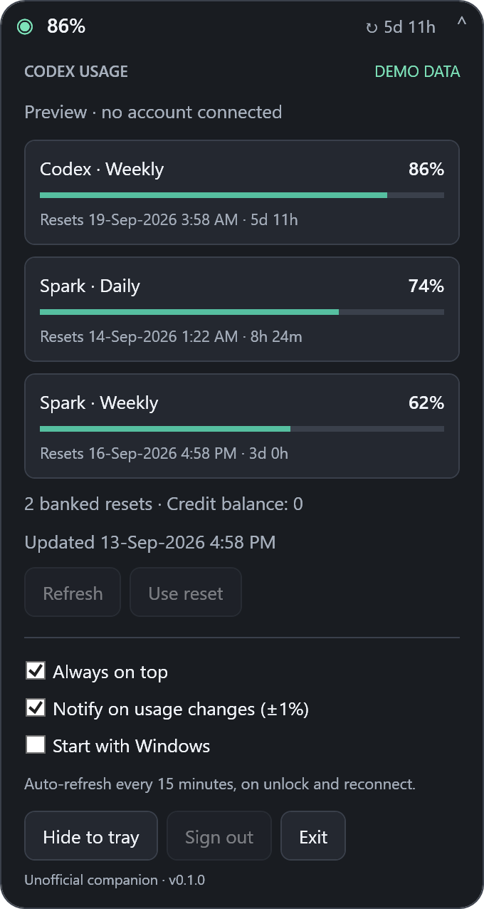

# Codex Usage for Windows

A tiny, native Windows companion for Codex usage. Keep a **190 × 36 DIP floating pill** near your taskbar: remaining percentage and time until reset. Click for details; drag to move.


## Download and run

1. Download `Codex-Usage-Windows-v0.1.0-win-x64.exe` from [Releases](https://github.com/guberm/Codex-Usage-Windows/releases/latest).
2. Keep it in a permanent folder and run it. Windows 10/11 x64; no separate .NET installation or administrator rights required.
3. Click **Sign in with ChatGPT**, enter the displayed code in the browser, and authorize your account. If requested, enable device code authorization under ChatGPT **Settings → Security**.
4. Click the header to collapse. Drag the pill where you want it. Right-click for refresh, positioning, hide and exit.

The executable is unsigned. Release checksums are provided in `SHA256SUMS.txt`.

## Daily use

- **Floating pill:** percentage remaining, countdown, always-on-top toggle, remembered position. Choose any limit by clicking its card.
- **Details:** all reported Codex primary/secondary and additional limits (including Spark), local reset dates, banked resets and credit balance.
- **Tray:** a numeric remaining-percentage icon; click to show details. Launching the app again restores the existing instance.
- **Refresh:** manually, every 15 minutes, when Windows unlocks, resumes, or network connectivity returns.
- **Notifications:** primary Codex remaining percentage changes by at least 1%; configurable in the panel. Windows notification settings / Do Not Disturb can suppress alerts.
- **Banked resets:** each action requires confirmation. A request ID is saved before sending; an uncertain request can be retried using **Retry reset**, including when the reported credit balance has already fallen to zero.
- **Appearance:** follows the Windows app light/dark preference. Enter/Space toggles the focused header; Escape collapses details.
- **Startup:** opt in with **Start with Windows**. Keep the executable at the same path, or disable/re-enable the option after moving it.

This is a floating window above the taskbar work area, not an embedded Windows taskbar extension. A `!` marks stale data or a refresh error; an elapsed countdown does not invent a new allowance. If a monitor is removed, the window is brought back onto an available screen. Use the tray's **Move near taskbar** to recover its position.

<details><summary>Expanded preview (example data)</summary>



</details>

## Privacy and authentication

Uses the same device authorization flow and usage/reset API contract as [Codex Usage for Android](https://github.com/guberm/Codex-Usage-Android). No API keys, browser cookies or imported Codex sessions. OAuth credentials are encrypted with **Windows DPAPI, CurrentUser**, in `%LOCALAPPDATA%\CodexUsage\session.bin`. Settings, cached usage and the account-bound pending reset ID are local files in the same folder. No telemetry or third-party server is used.

Requests go to `auth.openai.com` for authentication and `chatgpt.com/backend-api/wham/` for usage and resets. This internal API may change; the app is an unofficial companion and is not affiliated with OpenAI. Local DPAPI protection does not protect against malicious software already running as your Windows user.

**Sign out** deletes stored credentials, usage cache and pending reset state. To remove the app: disable **Start with Windows**, choose **Exit**, delete the executable, and optionally remove `%LOCALAPPDATA%\CodexUsage`.

## Build and verify

Windows with the .NET 10 SDK:

```powershell
./build.ps1
```

Produces a self-contained single-file x64 executable and SHA-256 checksum in `artifacts/release/`. Runs 34 dependency-free checks for parsing, null fields, rounding, account claims, DPAPI, device code parsing, token refresh, and reset idempotency. Then launches the published executable for a WPF smoke test: compact/expanded views, limit selection, themes, stale status, pinning, hide/restore, tray and persisted preferences. Images and the result are saved in `artifacts/smoke/`.

```powershell
dotnet run --project tests/Checks.csproj
./artifacts/publish/CodexUsage.exe --demo
```

`--demo` uses clearly labelled example data and temporary storage; no authentication, reset, startup or usage requests are made. Automated checks use synthetic responses. A successful build does not establish live account authorization or successful consumption of a real reset credit.

## License

MIT. Copyright (c) 2026 Michael Guber.
